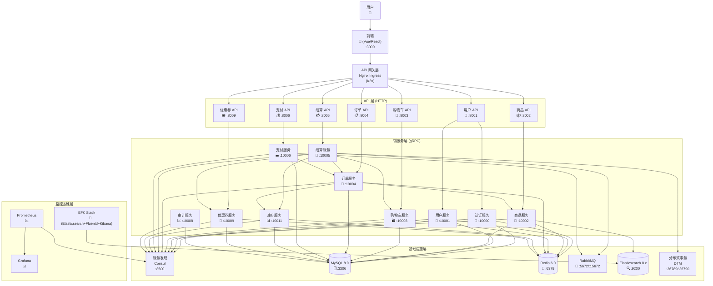
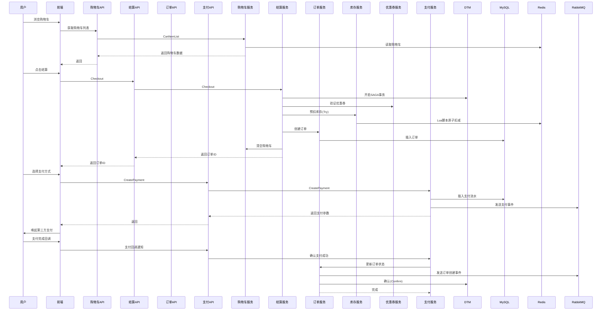

# Go-Mall 系统架构图

## 系统整体架构



## 分层架构详解

### 1. 接入层
- **前端应用**: 用户界面，运行在 :3000
- **API 网关**: Nginx Ingress (K8s 环境)

### 2. API 层 (HTTP)
| 服务 | 端口 | 功能 |
|------|------|------|
| user-api | 8001 | 用户认证、信息管理、地址管理 |
| product-api | 8002 | 商品查询、分类、搜索 |
| carts-api | 8003 | 购物车增删改查 |
| order-api | 8004 | 订单创建、查询、取消 |
| checkout-api | 8005 | 订单结算、价格计算 |
| payment-api | 8006 | 支付、退款 |
| coupon-api | 8009 | 优惠券领取、使用 |

### 3. 微服务层 (gRPC)
| 服务 | RPC 端口 | 监控端口 | 功能 |
|------|----------|----------|------|
| auths | 10000 | 11000 | JWT 认证、Token 管理 |
| users | 10001 | 11001 | 用户信息、收货地址 |
| product | 10002 | 11002 | 商品 SKU、分类、库存信息 |
| carts | 10003 | 11003 | 购物车数据 |
| order | 10004 | 11004 | 订单、订单项 |
| checkout | 10005 | 11005 | 结算、价格计算 |
| payment | 10006 | 11006 | 支付流水、回调处理 |
| inventory | 10011 | 11011 | 库存扣减、回滚 |
| coupons | 10009 | 11009 | 优惠券规则、用户券 |
| audit | 10008 | 11008 | 操作审计日志 |

### 4. 基础设施层
| 组件 | 端口 | 用途 |
|------|------|------|
| Consul | 8500 | 服务注册与发现 |
| MySQL | 3306 | 主数据库 |
| Redis | 6379 | 缓存、购物车、分布式锁 |
| RabbitMQ | 5672/15672 | 异步消息、订单事件 |
| Elasticsearch | 9200/9300 | 商品搜索 |
| DTM | 36789/36790 | 分布式事务协调 |

### 5. 监控运维层
- **Prometheus**: 指标采集
- **Grafana**: 可视化监控
- **EFK Stack**: 日志收集与分析

## 核心业务流程

### 下单流程


## 技术栈

### 开发框架
- **Go 1.20+**
- **Go-Zero 1.7.6**: 微服务框架
- **gRPC**: 服务间通信
- **JWT**: 身份认证

### 数据存储
- **MySQL 8.0**: 关系型数据库
- **Redis 6.0**: 缓存、会话、购物车、分布式锁
- **Elasticsearch 8.x**: 商品搜索引擎

### 消息与事务
- **RabbitMQ**: 异步消息队列
- **DTM**: 分布式事务 (TCC/SAGA模式)

### 服务治理
- **Consul**: 服务注册与发现

### 容器化与部署
- **Docker**: 容器化
- **Kubernetes (K8s)**: 容器编排
- **ArgoCD**: GitOps 持续部署
- **GitHub Actions**: CI/CD

### 监控与可观测性
- **Prometheus**: 指标采集
- **Grafana**: 监控可视化
- **OpenTelemetry**: 链路追踪
- **EFK Stack**: 日志管理 (Elasticsearch + Fluentd + Kibana)

## 项目目录结构
```
go-mall/
├── apis/              # API 层 (HTTP)
│   ├── user/
│   ├── product/
│   ├── carts/
│   ├── order/
│   ├── checkout/
│   ├── payment/
│   └── coupon/
├── services/          # 微服务层 (gRPC)
│   ├── auths/
│   ├── users/
│   ├── product/
│   ├── carts/
│   ├── order/
│   ├── checkout/
│   ├── payment/
│   ├── inventory/
│   ├── coupons/
│   └── audit/
├── common/            # 公共模块
│   ├── config/
│   ├── consts/
│   ├── middleware/
│   ├── response/
│   └── utils/
├── dal/               # 数据访问层
├── cmd/               # 命令行工具
├── construct/         # 基础设施配置
├── manifests/         # K8s 部署清单
├── frontend/          # 前端代码
├── scripts/           # 脚本工具
├── test/              # 测试
├── run.go             # 本地服务启动器
└── docker-compose.yml # Docker 编排
```
